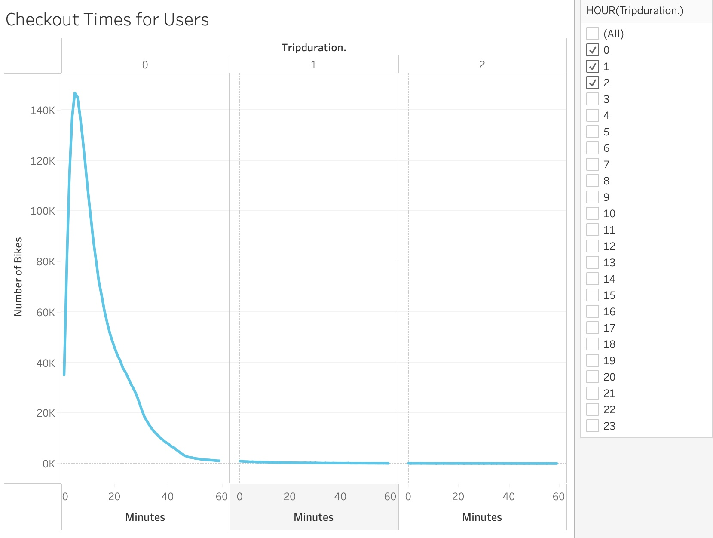
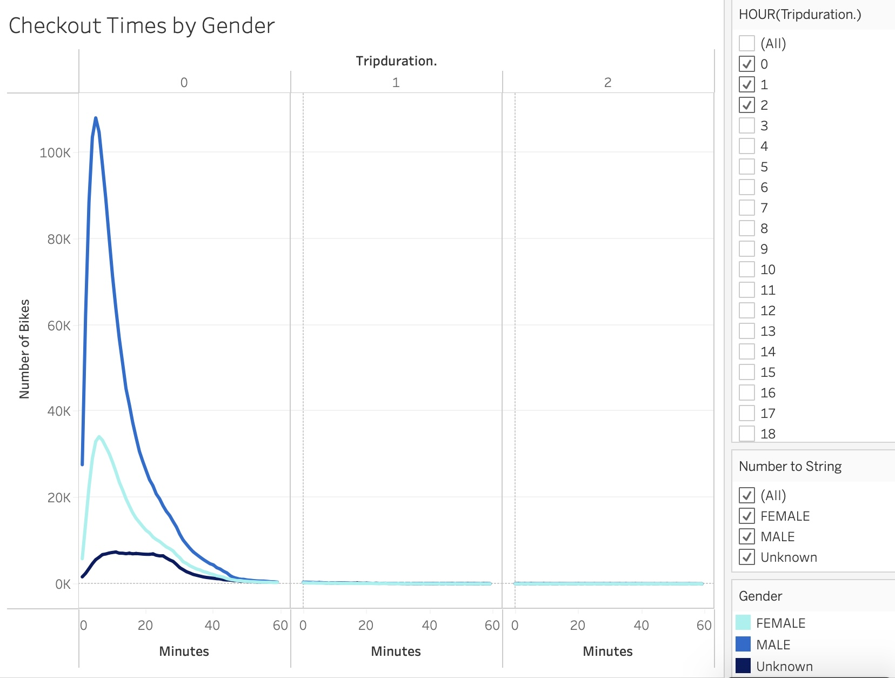
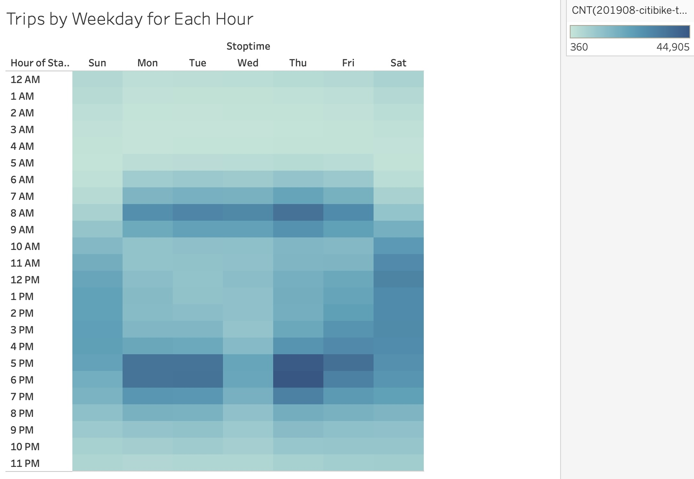
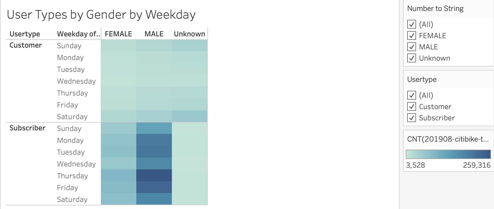

# NYC Citibike Bikesharing

## Overview
The purpose of this project is to conduct an analysis on NYC Citibike data to help create a solid business proposal for a bike-sharing program in Des Moines. 
To begin the analysis, I used Pandas to change the "tripduration' column from an integer to a datetime datatype. Using the converted datatype I created visualizations to support the businesss proposal. 

## Link to Tableau Story
[Tableau Story](https://public.tableau.com/app/profile/alejandra.magana/vizhome/NYCCitibikeChallenge_16408272086330/Story1?publish=yes)

## Results
1. Checkout Times for Users

The most common ride length is only 5 minutes. However there is a significant number of longer rides. 

2. Checkout Times by Gender

Most riders are make with ride lengths at 5 minutes. There is a significant number of Female riders who have a most common ride length of 6 minutes. 

3. Trips by Weekday for Each Hour

The Highest number of bike trips (44,905) occur on Thursdays at 6 P.M. However, there are riding trip peaks Monday-Friday between 7 A.M. - 10 A.M. and Saturday - Sunday between 11 A.M.- 7 P.M. 

4. Trips by Gender (Weekday per Hour)
.jpg)
The highesst number of bike trips (30,749) occur on Thursdays at 6 P.M. by Males. Female most common bike trips (11,336) also occur on Thursdays at 6 P.M.

5. User Types by Gender by Weekday

Almost all rides are made by annual subscribers. Showing that there is a core group of dedicated users, both male and female.

## Summary
- From our analysis we can conclude that Male subscribers are the highest users and follow the traditional high peak hours of travel to and from work. This conclusions leads to the recommendation that the target market should be Males in need of transportation to work and for weekend activities. Marketing should push for the subscription option.
- For future marketing purposes it would be worth conducting additional analysis. One analysis could be on ride starting locations by gender to understand where and what type of advertising could be placed. A second analysis could be on user type starting locations to see how far riders are riding and be able to understand the appropriate advertising radius. 
